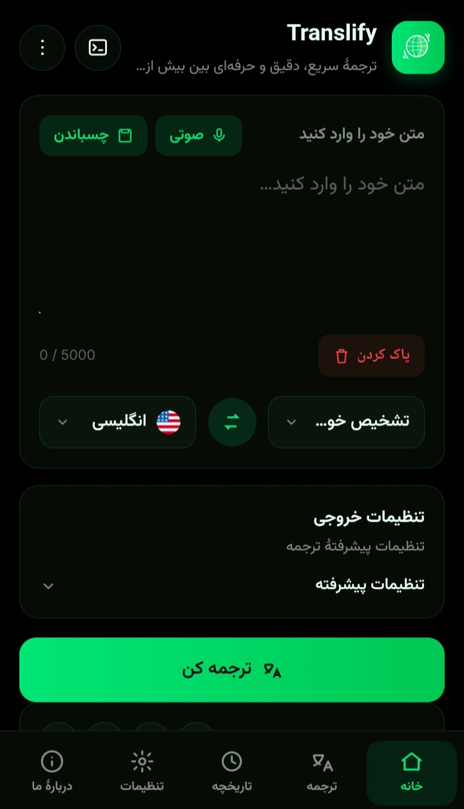
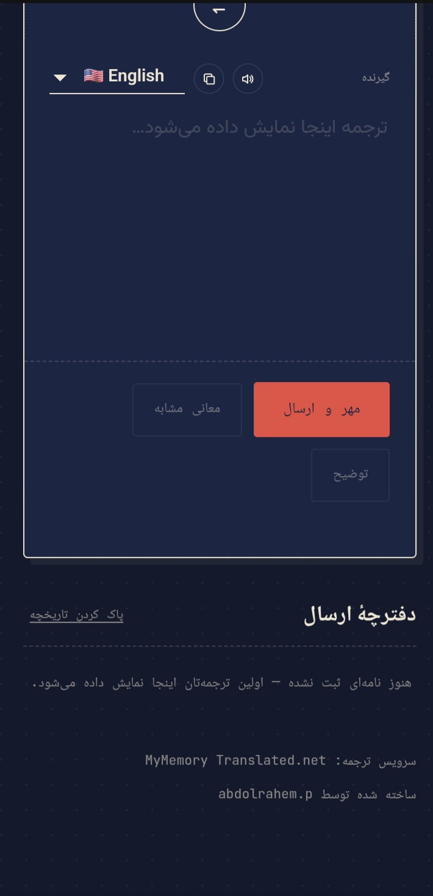
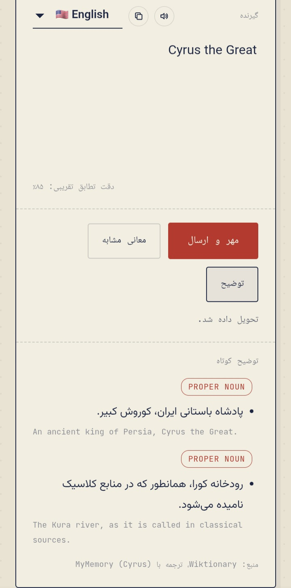

# 🌍 ZabanPeik | زبان‌پیک

<p align="center">
  <strong>Fast, Simple & Responsive Online Text Translator</strong><br>
  <strong>مترجم آنلاین سریع، ساده و واکنش‌گرا</strong>
</p>

---

## 🇬🇧 English

### 📖 About

ZabanPeik is a lightweight online text translator built with HTML. It provides fast translation between multiple languages with a clean interface and useful features like Text-to-Speech and Copy.

### ✨ Features

- 🌐 Translate between multiple languages
- ⚡ Fast and lightweight
- 📱 Responsive design
- 🔊 Text-to-Speech support
- 📋 Copy translated text
- 🌙 Dark mode
- 🆓 Free to use

### 🚀 Live Demo

https://codewave4.github.io/zabanpeik/

### 🛠 Built With

- HTML
- MyMemory Translation API

### 📸 Screenshots

#### Home Page



#### Translation



#### Mobile View



---

## 🇮🇷 فارسی

### 📖 درباره پروژه

زبان‌پیک یک مترجم آنلاین سبک و سریع است که با HTML توسعه داده شده است. این پروژه امکان ترجمه متن بین زبان‌های مختلف را با رابط کاربری ساده و امکانات کاربردی فراهم می‌کند.

### ✨ امکانات

- 🌐 ترجمه بین زبان‌های مختلف
- ⚡ سرعت بالا
- 📱 طراحی واکنش‌گرا
- 🔊 تبدیل متن به گفتار
- 📋 کپی متن ترجمه‌شده
- 🌙 حالت تیره
- 🆓 استفاده رایگان

### 🚀 نسخه آنلاین

https://codewave4.github.io/zabanpeik/

### 🛠 فناوری‌های استفاده‌شده

- HTML
- MyMemory Translation API

### 📸 تصاویر پروژه

#### صفحه اصلی


#### ترجمه متن


#### نمای موبایل


---

## 📂 Project Structure

```
zabanpeik/
│
├── index.html
├── README.md
├── LICENSE
└── images/
    ├── screenshot-1.jpg
    ├── screenshot-2.jpg
    └── screenshot-3.jpg
```


---

## ⭐ Support

If you like this project, please give it a ⭐ on GitHub.
